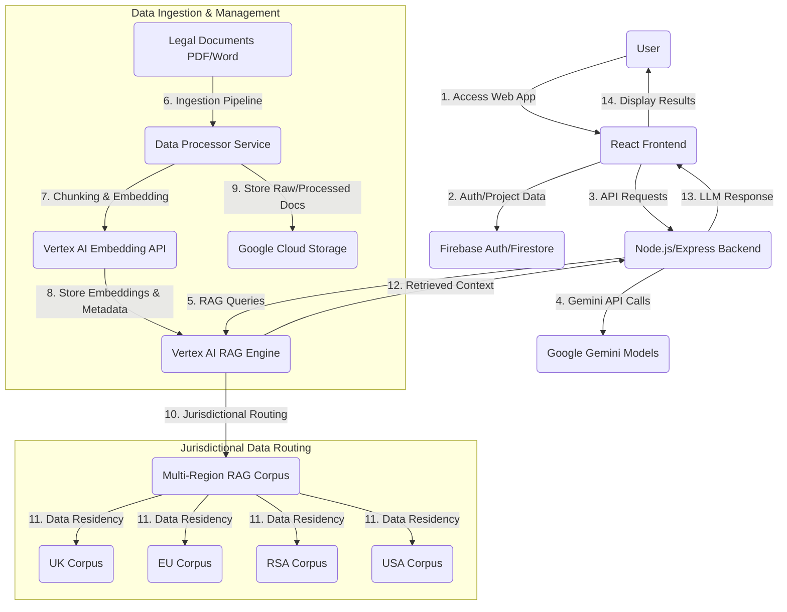

# Smart Charter AI: Optimal Execution Solution Guide

## 1. Introduction

This document outlines the most effective technical solution for executing the Smart Charter AI RAG system, addressing the identified limitations of Firebase, particularly concerning large-scale legal data, advanced RAG capabilities, and multi-jurisdictional compliance. The proposed architecture leverages a hybrid approach, combining the strengths of your existing Firebase/Node.js stack with specialized Google Cloud services for robust, scalable, and compliant legal RAG.

## 2. High-Level Architecture Overview

To overcome Firebase's limitations while maintaining a performant and compliant system, a hybrid architecture is recommended. This approach offloads heavy-duty RAG components and sensitive jurisdictional data to dedicated, enterprise-grade services within Google Cloud Platform (GCP), while Firebase continues to manage user authentication, project metadata, and potentially less sensitive, globally accessible data.

## 3. Data Ingestion and Processing Pipeline

To handle diverse legal document formats and large volumes of data across multiple jurisdictions, a robust ingestion pipeline is crucial.

### 3.1 Document Ingestion and High-Fidelity Reconstruction

*   **Initial Ingestion**: Continue using your existing Node.js backend with `officeparser` for initial text extraction from PDF/Word documents. This initial step should focus on extracting raw text and basic structural elements.
*   **High-Fidelity Markdown Reconstruction**: Instead of directly storing in Firestore, the extracted text should be sent to a dedicated processing service (e.g., a Cloud Function or a custom service on Cloud Run) that utilizes Gemini models (or specialized NLP libraries) to reconstruct the document into high-fidelity Markdown. This service can also extract initial metadata.
*   **Chunking Strategy**: Implement advanced chunking techniques to optimize retrieval and overcome Firestore's document size limitations. This includes:
    *   **Semantic Chunking**: Grouping text based on meaning rather than arbitrary length, ensuring clauses and related legal concepts remain together [3].
    *   **Hierarchical Chunking**: Creating chunks at different granularities (e.g., paragraph, section, document) and tagging them with metadata to preserve document structure and context [3].
    *   **Metadata Tagging**: Extracting and attaching rich metadata (e.g., document type, jurisdiction, parties, dates, key clauses, risk scores) to each chunk. This metadata will be critical for filtering and re-ranking [4].

### 3.2 Embedding Generation and Storage

*   **Vertex AI Embedding API**: Utilize the Vertex AI Embedding API for generating high-quality vector embeddings for each chunk. This offloads the computational burden and ensures compatibility with other Vertex AI services [5].
*   **Dedicated Vector Database (Vertex AI RAG Engine Corpus)**: Instead of relying solely on Firestore for vector search, leverage the **Vertex AI RAG Engine** as your primary vector store and retrieval mechanism [2]. This service is purpose-built for RAG, offering:
    *   **Scalability**: Designed for large-scale document corpora and high-throughput queries.
    *   **Advanced Indexing**: Manages vector indexes efficiently, overcoming Firestore's manual indexing and composite index limits.
    *   **Integrated Retrieval**: Provides built-in retrieval and re-ranking capabilities, which are crucial for legal RAG [2].
    *   **Metadata Filtering**: Allows filtering of search results based on the rich metadata attached to chunks, enabling jurisdiction-specific or clause-type specific retrieval [2].

## 4. Jurisdictional Routing and Data Residency

To meet strict data residency and compliance requirements for USA, UK, EU, and RSA, a multi-region and metadata-driven approach is essential.

### 4.1 Multi-Region RAG Corpus

*   **Separate RAG Corpora per Jurisdiction**: Create distinct Vertex AI RAG Engine Corpora for each major jurisdiction (USA, UK, EU, RSA). Each corpus would store documents and their embeddings relevant to that specific legal system. This ensures physical data separation and compliance with data residency laws.
*   **Geographic Data Storage**: For raw and reconstructed documents, use **Google Cloud Storage (GCS)** buckets configured with regional locations corresponding to the jurisdiction (e.g., `europe-west2` for UK, `europe-west1` for EU, `southafrica-north1` for RSA, `us-central1` for USA). GCS offers strong data residency guarantees [6].

### 4.2 Dynamic Jurisdictional Routing

*   **User Profile and Project Settings**: Your Firebase user authentication and project metadata (in Firestore) should store the primary jurisdiction(s) relevant to a user or a specific project.
*   **Backend Routing Logic**: The Node.js/Express backend will implement intelligent routing logic. When a RAG query is initiated, the backend will:
    1.  Identify the relevant jurisdiction(s) from the user's profile or project settings.
    2.  Dynamically select the appropriate Vertex AI RAG Engine Corpus (or multiple corpora for cross-jurisdictional queries).
    3.  Optionally, filter queries using metadata (e.g., `jurisdiction: 'UK'`) to ensure only relevant documents are retrieved, even within a multi-jurisdictional corpus if that approach is chosen for less strict residency needs.

## 5. RAG Implementation and Anti-Hallucination Guardrails

Leveraging Vertex AI RAG Engine and integrating robust guardrails will ensure high-quality, faithful responses.

### 5.1 Enhanced Retrieval and Generation

*   **Vertex AI RAG Engine Retrieval**: The RAG Engine will perform the initial retrieval of relevant chunks based on the user's query and selected corpus. Its built-in re-ranking capabilities will prioritize the most pertinent information [2].
*   **Gemini for Generation**: The retrieved context (high-fidelity Markdown chunks) will be passed to your primary Google Gemini models (e.g., `gemini-1.5-pro`) for generating answers, summaries, or clause-level queries. The larger context window of Gemini models is highly beneficial for legal documents.
*   **Structured Outputs**: Continue to enforce strict JSON schema outputs for Gemini responses where applicable, ensuring structured and parseable results for your frontend [7].

### 5.2 Robust Anti-Hallucination Guardrails

Building upon previous research, integrate multiple layers of guardrails:

*   **Source Attribution and Citation**: Ensure every generated response includes clear citations to the specific legal documents and even the exact clauses/sections from which information was retrieved. This allows users to verify the information [8].
*   **Confidence Scoring**: Implement a mechanism to score the confidence of the generated answer based on the relevance and density of retrieved context. Low-confidence answers can be flagged for human review [9].
*   **Self-Correction and Verification**: Employ techniques where the LLM is prompted to self-verify its answers against the retrieved context. This can involve asking the LLM to identify if its generated response is fully supported by the provided sources [10].
*   **NVIDIA NeMo Guardrails (Fallback/Advanced)**: For an additional layer of safety, especially if using NVIDIA NIM as a fallback, integrate NVIDIA NeMo Guardrails. These can enforce conversational boundaries, prevent unsafe content, and ensure responses adhere to predefined legal compliance rules [11].
*   **Human-in-the-Loop**: For high-risk queries or flagged low-confidence responses, route them to human legal experts for review and correction. This continuous feedback loop can also be used to fine-tune the RAG system and guardrails.

## 6. Integration with Existing Stack

This enhanced architecture integrates seamlessly with your current setup:

*   **Frontend (React/Vite)**: Remains largely unchanged, making API calls to your Node.js backend.
*   **Backend (Node.js/Express)**: Becomes the central orchestrator. It handles user authentication (via Firebase ID tokens), routes RAG queries to the appropriate Vertex AI RAG Engine corpus, sends retrieved context to Gemini, and enforces guardrails.
*   **Firebase (Auth, Firestore)**: Continues to manage user authentication and store project-specific metadata, user preferences, and potentially smaller, less sensitive data that doesn't require strict jurisdictional residency.

## 7. Scalability and Performance

*   **Vertex AI RAG Engine**: Designed for enterprise-scale, handling massive legal corpora and high query volumes efficiently.
*   **Vertex AI Embedding API**: Provides scalable embedding generation without impacting your backend resources.
*   **Google Cloud Storage**: Offers highly scalable and durable storage for raw and processed legal documents.
*   **Cloud Functions/Cloud Run**: Can be used for scalable, event-driven data processing and ingestion tasks, automatically scaling up and down based on demand.
*   **Global Network**: Leveraging GCP's global network ensures low-latency access to data and services for users across different regions.

## 8. Cost Considerations

While this solution offers significant advantages, it introduces new cost components:

*   **Vertex AI RAG Engine**: Billing is typically based on data stored (corpus size), indexing operations, and retrieval queries [12].
*   **Vertex AI Embedding API**: Billed per 1,000 characters processed for embeddings [13].
*   **Google Cloud Storage**: Costs are based on storage volume, network egress, and operations [14].
*   **Cloud Functions/Cloud Run**: Billed based on invocations, CPU, memory, and network usage [15].

Careful monitoring of usage and optimizing data ingestion and query patterns will be essential to manage costs effectively.

## 9. Conclusion

By adopting this hybrid architecture, Smart Charter AI can transcend the limitations of a purely Firebase-centric approach, providing a highly scalable, performant, and jurisdictionally compliant RAG system. This solution ensures that your application delivers accurate, high-fidelity legal insights while robustly guarding against hallucinations, positioning Smart Charter AI as a leading solution in contract management.

## 10. References

[1] Medium. *Vertex AI Search vs Vertex AI Vector Search: What's the actual difference*. Available at: [https://medium.com/@saichandra2520/vertex-ai-search-vs-vertex-ai-vector-search-whats-the-actual-difference-5038213b88ac]
[2] Google Cloud. *Vertex AI RAG Engine overview*. Available at: [https://docs.cloud.google.com/vertex-ai/generative-ai/docs/rag-engine/rag-overview]
[3] Reddit. *Advanced Chunking/Retrieving Strategies for Legal Documents*. Available at: [https://www.reddit.com/r/Rag/comments/1jdi4sg/advanced_chunkingretrieving_strategies_for_legal/]
[4] Medium. *Chunking Strategies for Retrieval-Augmented Generation (RAG): A Comprehensive Guide*. Available at: [https://medium.com/@adnanmasood/chunking-strategies-for-retrieval-augmented-generation-rag-a-comprehensive-guide-5522c4ea2a90]
[5] Google Cloud. *Get text embeddings*. Available at: [https://cloud.google.com/vertex-ai/docs/generative-ai/embeddings/get-text-embeddings]
[6] Google Cloud. *Cloud Storage locations*. Available at: [https://cloud.google.com/storage/docs/locations]
[7] Google Cloud. *Specify output format and schema*. Available at: [https://cloud.google.com/vertex-ai/docs/generative-ai/multimodal/json-mode]
[8] Stanford University. *Hallucination-Free? Assessing the Reliability of Leading AI Legal Research Tools*. Available at: [https://law.stanford.edu/wp-content/uploads/2024/05/Legal_RAG_Hallucinations.pdf]
[9] Deepchecks. *RAG Evaluation Metrics: Answer Relevancy, Faithfulness, Accuracy*. Available at: [https://deepchecks.com/rag-evaluation-metrics-answer-relevancy-faithfulness-accuracy/]
[10] ArXiv. *S$^2$R: Teaching LLMs to Self-verify and Self-correct via Iterative Refinement*. Available at: [https://arxiv.org/abs/2502.12853]
[11] NVIDIA. *NVIDIA NeMo Guardrails for Developers*. Available at: [https://developer.nvidia.com/nemo-guardrails]
[12] Google Cloud. *RAG Engine billing*. Available at: [https://cloud.google.com/vertex-ai/generative-ai/docs/rag-engine/rag-engine-billing]
[13] Google Cloud. *Vertex AI pricing*. Available at: [https://cloud.google.com/vertex-ai/pricing#text_embeddings]
[14] Google Cloud. *Cloud Storage pricing*. Available at: [https://cloud.google.com/storage/pricing]
[15] Google Cloud. *Cloud Functions pricing*. Available at: [https://cloud.google.com/functions/pricing]
